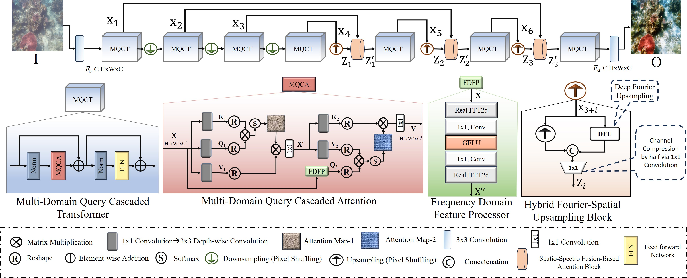

<p align="center">
  <h1 align="center">Spectroformer: Multi-Domain Query Cascaded Transformer Network For Underwater Image Enhancement</h1>
  <p align="center">
    <a href="https://mdraqibkhan.github.io">Md Raqib Khan</a>
    ·
    <a href="https://scholar.google.com/citations?user=UcUMYe8AAAAJ&hl=en&oi=sra">Priyanka Mishra</a>
    ·
    <a href="https://scholar.google.com/citations?user=WwdYdlUAAAAJ&hl=en&oi=sra">Nancy Mehta </a>
    ·
    <a href="https://scholar.google.com/citations?user=HgX8wb8AAAAJ&hl=en&oi=sra">Shruti S. Phutke</a>
    ·
    <a href="https://visionintelligence.github.io">Santosh Kumar Vipparthi</a>
    ·
    <a href="https://www.iitg.ac.in/sukumar/">Sukumar Nandi</a>
    ·
    <a href="https://www.scss.tcd.ie/~muralas/">Subrahmanyam Murala</a>
  </p>
  <h3 align="center">WACV-2024</h3>
  <h3 align="center"><a href="https://openaccess.thecvf.com/content/WACV2024/papers/Khan_Spectroformer_Multi-Domain_Query_Cascaded_Transformer_Network_for_Underwater_Image_Enhancement_WACV_2024_paper.pdf">Paper</h3>
  <div align="center"></div>
</p>
<p align="center">
  <a href="">
    
  </a>
</p>


# Evaluation 

To evaluate the model on different datasets using the provided checkpoints and sample degraded images.

## Dataset and Checkpoint Structure

- **Sample degraded images for testing**: Available in `dataset/dataset_name/`.
- **Checkpoints for evaluation**: Provided in `checkpoints/dataset-name/`.
- **Results storage**: After successful execution, the results will be saved in the `results/dataset-name/` folder.

### Folder Overview 
```
├── dataset
│   ├── UIEB
│   ├── U-45
│   ├── SQUID
│   ├── UCCS
├── checkpoints
│   ├── UIEB
│   ├── U-45
│   ├── SQUID
│   ├── UCCS
├── results
│   ├── UIEB
│   ├── U-45
│   ├── SQUID
│   ├── UCCS

```
## Running the Evaluation

To evaluate the model on different datasets, follow the instructions below for each specific dataset:

### UIEB Dataset Evaluation
Run the following command to evaluate the model on the UIEB dataset:
```
python test.py --dataset datasets/UIEB/ --save_path Results/UIEB
```

###  U-45 Dataset Evaluation
Run the following command to evaluate the model on the U-45 dataset:
```
python test.py --dataset dataset/U-45/ --save_path Results/U-45
```
### SQUID Dataset Evaluation
Run the following command to evaluate the model on the SQUID dataset:
```
python test.py --dataset dataset/SQUID/ --save_path Results/SQUID
```
### UCCS Dataset Evaluation
Run the following command to evaluate the model on the UCCS dataset:
```
python test.py --dataset dataset/UCCS/ --save_path Results/UCCS

```


## Traing
1. Structure of data for training should be like
 ```Shell
 uw_data/
    ├── train/
    │   ├── a/  # Input images
    │   └── b/  # Reference (ground truth) images
    └── test/
        ├── a/  # Input images
        └── b/  # Reference (ground truth) images
```


3. run
```
  pyhthon train.py
```

## Citation
If you find this work helpful, please reference it as follows:

```
@inproceedings{khan2024spectroformer,
  title={Spectroformer: A Multi-Domain Query Cascaded Transformer Network for Underwater Image Enhancement},
  author={Khan, Raqib and Mishra, Priyanka and Mehta, Nancy and Phutke, Shruti S and Vipparthi, Santosh Kumar and Nandi, Sukumar and Murala, Subrahmanyam},
  booktitle={Proceedings of the IEEE/CVF Winter Conference on Applications of Computer Vision},
  pages={1454--1463},
  year={2024}}
```


## Acknowledgements 
Special thanks to the awesome repositories [UIPTA](https://github.com/Mdraqibkhan/UIEPTA) and [Restoremer](https://github.com/swz30/Restormer), which made this project possible.
